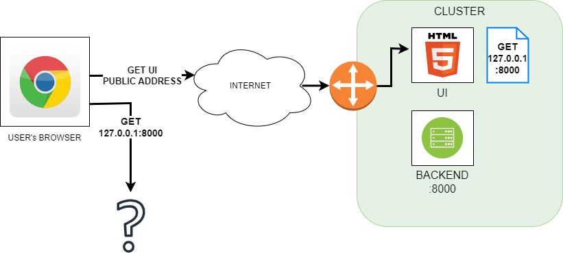
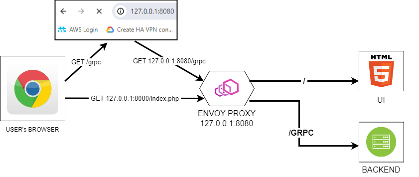

# awi-ui

CISCO SD-WAN Application

The client is responsible for managing connections between different network domains. 

It allows you to:

1. discover network domains (either stub or vmanage)
2. create new network domains (currently static stub only)
3. create connections between aforementioned connections (either stub or vmanage)
4. view connections between network domains (either stub or vmanage)
5. create SLA profiles for aforementioned connections (currently static stub only)


# Tech stack

1. React + TypeScript, redux-toolkit
2. CRA + Craco
3. Ant Design, ag-grid community
4. React Router
5. grpc-web

# How to run

You can decide whether the app should run on stub data or on live vmanage servers. You set this in your local `.env.local` file in the root. If `REACT_APP_BUILD` is set to `live` the app will try to fetch all the data from vmanage and if it's set to `stub` it will try to access json-server with data in `src/_db/db.json`.
In both cases you should follow the steps bellow.

1. Run `npm install` from the root folder
2. Setup vmanage servers and Envoy proxy
3. Setup `REACT_APP_BUILD` to desired setting
4. To start the UI run `npm start` from the root. This starts both the actual client and stubbed data from json-server

UI should be available at http://localhost:5001/

# Work flow

1. Each cycle a `develop` branch is setup, as starting point for functionality development
2. To create a feature branch first checkout `develop` branch and then create the branch by `git checkout -b CIS21-[changes name]`
3. After finishing the work create a PR to `develop` branch
4. After each cycle `develop` is merged into `master`

# Building docker image

To build your image simply run

```
docker build -t awi-ui:1.0 .
```

To push your image to ECR registry tag it and then push

```
docker tag awi-ui:1.0 229451923406.dkr.ecr.us-west-2.amazonaws.com/awi/awi-ui:1.0
docker push 229451923406.dkr.ecr.us-west-2.amazonaws.com/awi/awi-ui:1.0
```

The current image uses nginx as a base which helped decreasing the
image size to 90 MB and also made it much faster to start the container
as there is no building process during the start but rather serving
static files.

# Backend Calls

It is crucial to remember that JS calls implemented in this UI are not sent by the
UI process/container but they are coming directly from the web browser or any other
client used by the user.



In this example, the UI application serves a JS file with a
logic that performs a call to the backend service present within
the same cluster, reachable from the UI on port `:8000`. The
problem is that the call will be performed by the Chromium
browser used by the client and so it will try to send it to
the localhost on port 8000 which will most likely fail (unless
the user uses the browser on the same host where the backend
server runs).

So the JS files cannot use the addressing used internally within
a server machine or a k8s cluster - these addresses must be
reachable from the user's device.

Of course, the backend service does not need to be exposed
directly but it will be rather hidden behind a reverse proxy.
It, however, gives us another problem - the front-end application
needs to be aware of the public address which is used by the
proxy. It can be solved by a few options:

* using final DNS name - having an actual DNS name associated with
    our server, we can simply hardcode it. However, it is not a
    good solution as changing the domain will require rebuilding
    the front-end application. Additionally, this solution works
    only if it is expected that there will be only one instance
    of front-end (SaaS) but if each potential customer can have his own front-end instance deployed on on-prem systems, it
    becomes a problem (even in case of SaaS we still may want to
    deploy separate production and testing front-end)

* providing address as a runtime parameter - the second option is
    to use a variable with the address which is set with the
    environment variable or commandline argument. That way the
    entire system can be deployed, the public address retrieved
    and then the UI application restarted with modified config
    (config-map in k8s deployment or docker-compose scripts).
    However, using variables requires JS server which results in
    higher image size and container start-up time. Serving static
    JS files with NGinx image saves a lot of size and gives a
    quick application restart - however it makes it harder to
    use a configuration variable - such solution would require
    either some nginx libraries/extensions or simple tools to
    override every JS file using that address with a proper value
    (simple sed script for instance). This solution is also
    problematic if our public address changes quite often - it
    would require constant front-end restarting.

* do not provide an actual address

The last solution is the one we use:



The approach is simple. The JS code describes only endpoints for
backend calls, for instance `/grpc/Clouds` rather than
`http://myapp.net.io/grpc/Clouds`. If the address is not provided,
the client will use the address it used to download a particular
JS Document.

For instance, we have entered our UI by specifying
`127.0.0.1:8080/index.php` in the web browser. The page defines
one script that calls backend service using `/grpc` call. Since
the `index.php` page was downloaded from `127.0.0.1:8080` the
same address will be used to complete `/grpc` call giving as a
result the address `127.0.0.1:8080/grpc`.

This solution has a condition - both UI and the backend need
to be reachable under the same address. For that matter, we need
a reverse proxy to push our front-end requests to the UI and our
backend requests to corresponding services. The front-end cannot
be in front as the logic above would redirect all backend calls
back to the UI.

For that reason, we have introduced a `/grpc` prefix for all
GRPC backend calls so that we can configure Envoy Proxy to
distinguish backend requests starting with `/grpc` prefix from
the rest of the calls that should be redirected to the UI.
